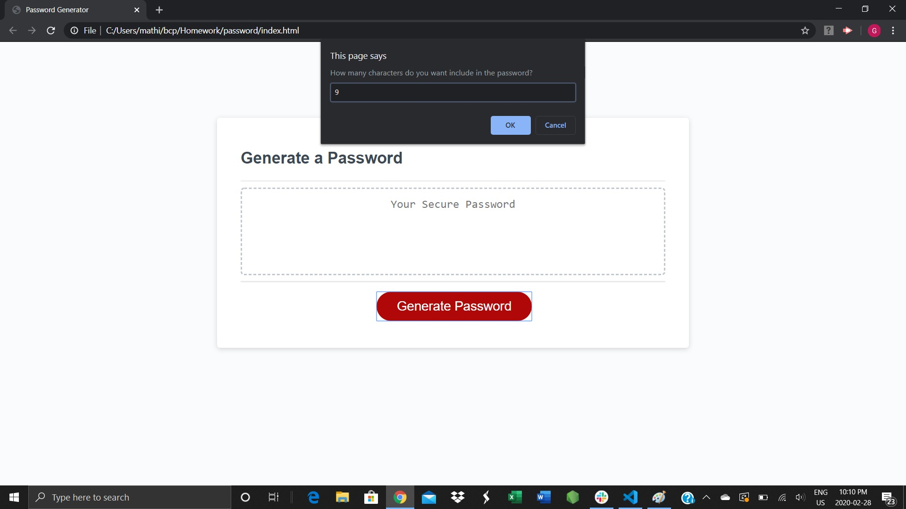
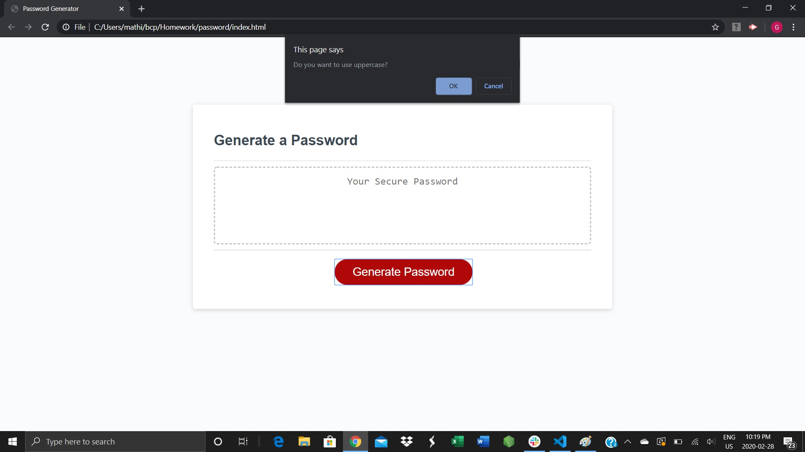
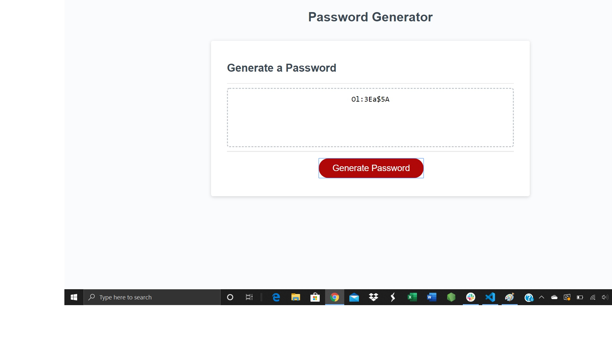

# This website is used to generate random password

# User can provide the maximum length of the passowrd between 8 and 128 characters, which includes, upper,lower, number and special 
# charaters

# Based on the user selection, this website will generate the password randomly

# Please find the screenshots

# 
# 
# 

# link for the deployment:https://mathigayathri2001.github.io/password/